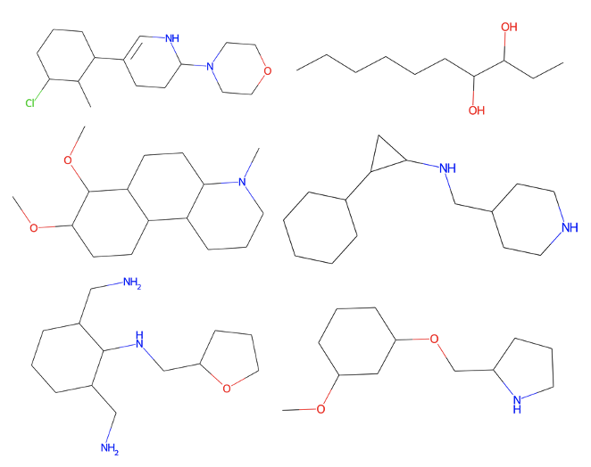
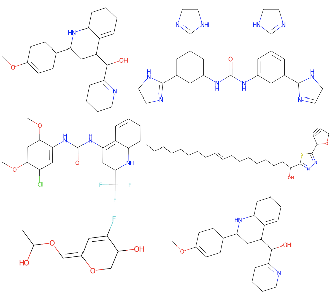

# DrugGEN: Target Centric De Novo Design of Drug Candidate Molecules with Graph Generative Deep Adversarial Networks


<p align="center">
  <a href="Give a link here"></a>
  <a href="Give a link here"></a>
  <a href="Give a link here" alt="license"></a>
</p>

<!--PUT HERE SOME QUALITATIVE RESULTS IN THE ASSETS FOLDER-->
<!--YOU CAN PUT ALSO IN THE GIF OR PNG FORMAT -->
<!--<p float="center">
  
  
</p>-->

## Abstract

Discovering novel drug candidate molecules is one of the most fundamental and critical steps in drug development. It is especially challenging to develop new drug-based treatments for complex diseases, such as various cancer subtypes, which have heterogeneous structure and affect multiple biological mechanisms. Generative deep learning models, which create new data points according to a probability distribution at hand, have been developed with the purpose of picking completely new samples from a distribution space that is only partially known. In this study, we propose a novel computational system, DrugGEN, for de novo generation of single and multi-target drug candidate molecules intended for specific drug resistant diseases. The proposed system represents compounds and protein structures as graphs and processes them using serially connected generative adversarial networks comprising graph transformers. For generated molecules to be drug-like, synthetic accessible, and be able to target the intended proteins, the model is conditioned with the properties of intended target proteins. The system is trained in a two-fold manner to design effective and specific inhibitory molecules against protein targets (e.g., AKT1) with critical importance in the hepatocellular carcinoma (HCC) disease, which is a deadly subtype of liver cancer. The resulting de novo molecules are being computationally evaluated and chemically synthesized, which will be followed by the validation of their inhibitory effects on drug resistant HCC cell lines within in vitro experiments. If the expected results are obtained, new and personalized inhibitors will be discovered for the treatment of HCC. DrugGEN has been developed as a generic system that can easily be used to design new molecules for other targets and diseases.

Check out our paper below for more details

> [**DrugGEN: Target Centric De Novo Design of Drug Candidate Molecules with Graph Generative Deep Adversarial Networks
**](link here),            
> [Atabey Ünlü](https://tr.linkedin.com/in/atabeyunlu), [Elif Çevrim](https://www.linkedin.com/in/elifcevrim/?locale=en_US), [Ahmet Sarıgün](https://asarigun.github.io/), [Heval Ataş](https://www.linkedin.com/in/heval-atas/), [Altay Koyaş](https://www.linkedin.com/in/altay-koya%C5%9F-8a6118a1/?originalSubdomain=tr), [Hayriye Çelikbilek](https://www.linkedin.com/in/hayriye-celikbilek/?originalSubdomain=tr), [Deniz Cansen Kahraman](https://www.linkedin.com/in/deniz-cansen-kahraman-6153894b/?originalSubdomain=tr), [Abdurrahman Olğaç](https://www.linkedin.com/in/aolgac/?originalSubdomain=tr), [Ahmet S. Rifaioğlu](https://saezlab.org/person/ahmet-sureyya-rifaioglu/), [Tunca Doğan](https://yunus.hacettepe.edu.tr/~tuncadogan/)     
> *Arxiv, 2020* 

<!--PUT THE ANIMATED GIF VERSION OF THE DRUGGEN MODEL (Figure 1)-->
<p float="center">
  
</p>


## Features

<!--PUT HERE 1-2 SENTECE FOR METHOD WHICH SHOULD BE SHORT --> Pleaser refer to our [arXiv report](link here) for further details.

This implementation:

- has the demo and training code for DrugGEN implemented in PyTorch Geometric,
- can design de novo drugs based on their protein interactions,
<!-- - supports both CPU and GPU inference (though GPU is way faster), -->
<!-- ADD HERE SOME FEATURES FOR DRUGGEN & SUMMARIES & BULLET POINTS -->


<!-- ADD THE ANIMATED GIF VERSION OF THE GAN1 AND GAN2 -->
| First Generator                                                                                                | Second Generator                                                                                               |
|------------------------------------------------------------------------------------------------------------|--------------------------------------------------------------------------------------------------------------------|
|  |  |


## Preliminary results (generated molecules)

| ChEMBL-25                                                                                                | ChEMBL-45                                                                                               |
|------------------------------------------------------------------------------------------------------------|--------------------------------------------------------------------------------------------------------------------|
|  |  |

## Overview
We provide the implementation of the DrugGEN in PyTorch Geometric framework, along with scripts to generate and run. The repository is organised as follows:

- ```data``` contains:

## Datasets
Three different data types (i.e., compound, protein, and bioactivity) were retrieved from various data sources to train our deep generative models. GAN1 module requires only compound data while GAN2 requires all of three data types including compound, protein, and bioactivity.
- **Compound data** includes atomic, physicochemical, and structural properties of real drug and drug candidate molecules. Small-scale QM9 compound dataset was used for the first version of GAN1 module for easy and fast processing. It consists of 133,885 stable organic molecules with a maximum of 9 atoms and containing only C, O, N, F heavy atoms. Then, GAN1 was retrained on large-scale ChEMBL compound dataset to improve model performance. Two versions of ChEMBL dataset were created considering heavy atom distribution of the dataset. Each is limited to a maximum atomic number of 25 and 45, and referred as ChEMBL-m25 and ChEMBL-m45, respectively. 12 heavy atom types were selected for both datasets considering the atom frequency, which are C, O, N, F, Ca, K, Br, B, S, P, Cl, and As. The number of molecules in ChEMBL-m25 and ChEMBL-m45 datasets is  651,509 and 1,588,865, respectively.
- **Protein data** was retrieved from Protein Data Bank (PDB) in biological assembly format, and the coordinates of protein-ligand complexes were used to construct the binding sites of proteins from the bioassembly data. The atoms of protein residues within a maximum distance of 9 A from all ligand atoms were recorded as binding sites. GAN2 was trained for generating compounds specific to the target protein AKT1, which is a member of serine/threonine-protein kinases and involved in many cancer-associated cellular processes including metabolism, proliferation, cell survival, growth and angiogenesis. Binding site of human AKT1 protein was generated from the kinase domain (PDB: 4GV1). 
- **Bioactivity data** of AKT target protein was retrieved from large-scale ChEMBL bioactivity database. It contains ligand interactions of human AKT1 (CHEMBL4282) protein with a pChEMBL value equal to or greater than 6 (IC50 <= 1 µM) as well as SMILES information of these ligands. The dataset was extended by including drug molecules from DrugBank database known to interact with human AKT proteins. Thus, a total of 3,251 bioactivity data points were obtained for training the AKT-specific generative model. To enhance the size of the bioactivity dataset, we also obtained two alternative versions by incorporating ligand interactions of protein members in non-specific serine/threonine kinase (STK) and kinase families.

More details on the construction of datasets can be found in our paper referenced above.


<!-- ADD SOME INFO HERE -->

## Updates

- 00/00/2022: First version script of DrugGEN is released.

## Getting Started
DrugGEN has been implemented and tested on Ubuntu 18.04 with python >= 3.9. It supports both GPU and CPU inference.
If you don't have a suitable device, try running our Colab demo. 

Clone the repo:
```bash
git clone https://github.com/asarigun/DrugGEN.git
```

Install the requirements using `virtualenv` or `conda`:
```bash
# pip
source install/install_pip.sh

# conda
source install/install_conda.sh
```
## Running the Demo
You could try Google Colab if you don't already have a suitable environment for running this project.
It enables cost-free project execution in the cloud. You can use the provided notebook to try out our Colab demo:
[](Give a link here)

## Training

<!--ADD HERE TRAINING COMMANDS WITH EXPLAINATIONS-->

## Citation
<!--ADD BIBTEX AFTER THE PUBLISHING-->

## License
<!--ADD LICENSE TERMS AND LICENSE FILE AND GIVE A LINK HERE-->

## References

In each file, we indicate whether a function or script is imported from another source. Here are some excellent sources from which we benefit: 
<!--ADD THE REFERENCES THAT WE USED DURING THE IMPLEMENTATION-->
- First GAN is borrowed from [MolGAN](https://github.com/yongqyu/MolGAN-pytorch)
- 
-
