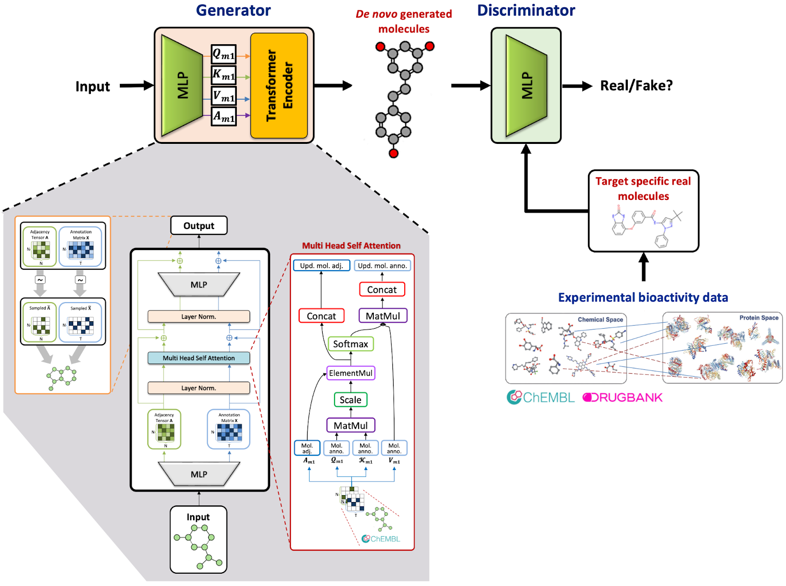
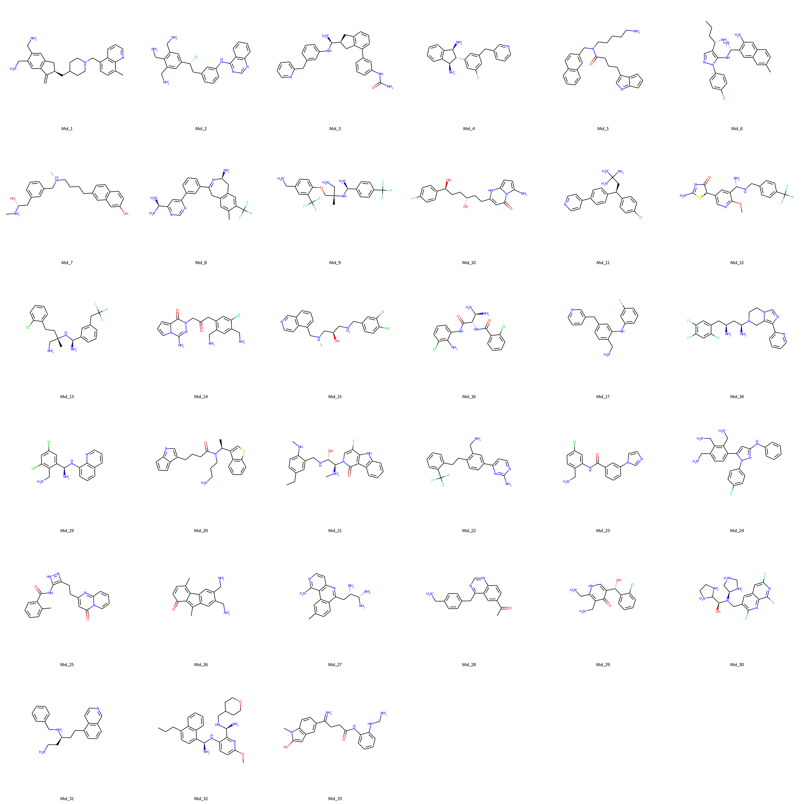

# DrugGEN: Target Specific De Novo Design of Drug Candidate Molecules with Graph Transformer-based Generative Adversarial Networks


<p align="center">
  <a href="https://github.com/HUBioDataLab/DrugGEN/files/10828402/2302.07868.pdf"></a>
  <a href="https://huggingface.co/spaces/HUBioDataLab/DrugGEN"></a>
  <a href="http://www.gnu.org/licenses/"></a>
  
</p>


## Updated Pre-print!

**Please see our most up-to-date document (pre-print) from 15.02.2023 here:** [2302.07868.pdf](https://github.com/HUBioDataLab/DrugGEN/files/10828402/2302.07868.pdf), [arXiv link](https://arxiv.org/abs/2302.07868)

&nbsp;
&nbsp;

## Abstract

Discovering novel drug candidate molecules is one of the most fundamental and critical steps in drug development. Generative deep learning models, which create synthetic data given a probability distribution, offer a high potential for designing de novo molecules. However, for them to be useful in real-life drug development pipelines, these models should be able to design target-centric molecules, which is the next step in this field. In this study, we propose an end-to-end generative system, DrugGEN, for the de novo design of drug candidate molecules that interact with intended target proteins. The proposed system represents molecules as graphs and processes them via a generative adversarial network comprising graph transformer layers. The system is trained using a large dataset of drug-like compounds and target-specific bioactive molecules to design effective inhibitory molecules against the AKT1 protein, which has critical importance for developing treatments against various types of cancer. We conducted further in silico analysis with molecular docking and dynamics to assess the target-centric generation performance of the model. Results indicate that our de novo molecules have a high potential for interacting with the AKT1 protein structure at the level of its native ligands. DrugGEN is freely available for designing completely novel ligands for any druggable protein, given a dataset of experimentally known bioactive molecules. Code base, datasets, results and trained models of DrugGEN are available in this repository.

Our up-to-date pre-print is shared [here](https://github.com/HUBioDataLab/DrugGEN/files/10828402/2302.07868.pdf)

<!--Check out our paper below for more details

> [**DrugGEN: Target Centric De Novo Design of Drug Candidate Molecules with Graph Generative Deep Adversarial Networks
**](link here),            
> [Atabey Ünlü](https://tr.linkedin.com/in/atabeyunlu), [Elif Çevrim](https://www.linkedin.com/in/elifcevrim/?locale=en_US), [Ahmet Sarıgün](https://asarigun.github.io/), [Heval Ataş](https://www.linkedin.com/in/heval-atas/), [Altay Koyaş](https://www.linkedin.com/in/altay-koya%C5%9F-8a6118a1/?originalSubdomain=tr), [Hayriye Çelikbilek](https://www.linkedin.com/in/hayriye-celikbilek/?originalSubdomain=tr), [Deniz Cansen Kahraman](https://www.linkedin.com/in/deniz-cansen-kahraman-6153894b/?originalSubdomain=tr), [Abdurrahman Olğaç](https://www.linkedin.com/in/aolgac/?originalSubdomain=tr), [Ahmet S. Rifaioğlu](https://saezlab.org/person/ahmet-sureyya-rifaioglu/), [Tunca Doğan](https://yunus.hacettepe.edu.tr/~tuncadogan/)     
> *Arxiv, 2020* -->

&nbsp;
&nbsp;

<!--PUT THE ANIMATED GIF VERSION OF THE DRUGGEN MODEL (Figure 1)-->
<p float="center">
  
</p>

**Fig. 1.** The schematic representation of the architecture of the DrugGEN model. Generator module of the GAN consists of a multi-layered perceptron (MLP) and a graph transformer encoder module. The generator encodes the given input into a new molecular representation; the MLP-based discriminator of the GAN compares the generated de novo molecules to the known inhibitors of the given target protein, scoring them for their assignment to the classes of “real” and “fake” molecules (abbreviations; MLP: multi-layered perceptron, Norm: normalization, Concat: concatenation, MatMul: matrix multiplication, ElementMul: element wise multiplication, Mol. adj: molecule adjacency tensor, Mol. Anno: molecule annotation matrix, Upd: updated).

&nbsp;
&nbsp;

## Transformer Module

Given a random noise *z*, **the generator** *G* (below) creates annotation and adjacency matrices of a supposed molecule. *G* processes the input by passing it through a multi-layer perceptron (MLP). The input is then fed to the transformer encoder module [Vaswani et al., (2017)](https://arxiv.org/abs/1706.03762), which has a depth of 1 encoder layers with 8 multi-head attention heads for each. In the graph transformer setting, *Q*, *K* and *V* are the variables representing the annotation matrix of the molecule. After the final products are created in the attention mechanism, both the annotation and adjacency matrices are forwarded to layer normalization and then summed with the initial matrices to create a residual connection.  These matrices are fed to separate feedforward layers, and finally, given to the discriminator network *D* together with real molecules.


<!--PUT HERE 1-2 SENTECE FOR METHOD WHICH SHOULD BE SHORT Pleaser refer to our [arXiv report](link here) for further details.--> 


<!-- - supports both CPU and GPU inference (though GPU is way faster), -->
<!-- ADD HERE SOME FEATURES FOR DRUGGEN & SUMMARIES & BULLET POINTS -->


<!-- ADD THE ANIMATED GIF VERSION OF THE GAN1 AND GAN2 -->
| Generator |
|------------------------------------------------------------------------------------------------------------|
 |  |

&nbsp;
&nbsp;

## Model Variations

- **DrugGEN** is the default model. The input of the generator is the real molecules (ChEMBL) dataset (to ease the learning process) and the discriminator compares the generated molecules with the real inhibitors of the given target protein.
- **NoTarget** is the non-target-specific version of DrugGEN. This model only focuses on learning the chemical properties from the ChEMBL training dataset.

&nbsp;
&nbsp;

## Files & Folders

We provide the implementation of the DrugGEN, along with scripts from PyTorch Geometric framework to generate and run. The repository is organised as follows:

```data``` contains: 
- **Raw dataset files**, which should be text files containing SMILES strings only. Raw datasets preferably should not contain stereoisomeric SMILES to prevent Hydrogen atoms to be included in the final graph data. 
- Constructed **graph datasets** (.pt) will be saved in this folder along with atom and bond encoder/decoder files (.pk).

```experiments``` contains: 
- ```logs``` folder. Model loss and performance metrics will be saved in this directory in seperate files for each model. 
- ```tboard_output``` folder. Tensorboard files will be saved here if TensorBoard is used.
- ```models``` folder. Models will be saved in this directory at last or preferred steps. 
- ```samples``` folder. Molecule samples will be saved in this folder.
- ```inference``` folder. Molecules generated in inference mode will be saved in this folder.

**Python scripts:**

- ```new_dataloader.py``` constructs the graph dataset from given raw data. Uses PyG based data classes.
- - ```utils.py``` contains performance metrics from several other papers and some unique implementations. (De Cao et al, 2018; Polykovskiy et al., 2020)
- ```layers.py``` contains **transformer encoder** implementation.  
- ```models.py``` has the implementation of the **Generator** and **Discriminator**.  
- ```train.py``` is the training file for the model. Workflow is constructed in this file.   
- ```inference.py``` is the testing file for the model. Workflow is constructed in this file.   

&nbsp;
&nbsp;

## Datasets

Two different data types (i.e., compound, and bioactivity) were retrieved from various data sources to train our deep generative models.
- **Compound data** includes atomic, physicochemical, and structural properties of real drug and drug candidate molecules. [ChEMBL v29 compound dataset](data/dataset_download.sh) was used for the GAN1 module. It consists of 1,588,865 stable organic molecules with a maximum of 45 atoms and containing  C, O, N, F, Ca, K, Br, B, S, P, Cl, and As heavy atoms. 
- **Bioactivity data** of AKT target protein was retrieved from large-scale ChEMBL bioactivity database. It contains ligand interactions of human AKT1 (CHEMBL4282) protein with a pChEMBL value equal to or greater than 6 (IC50 <= 1 µM) as well as SMILES information of these ligands. The dataset was extended by including drug molecules from DrugBank database known to interact with human AKT proteins. Thus, a total of [2,405 bioactivity data](data/Filtered_AKT_inhibitors.csv) points were obtained for training the AKT-specific generative model. 
<!-- To enhance the size of the bioactivity dataset, we also obtained two alternative versions by incorporating ligand interactions of protein members in non-specific serine/threonine kinase (STK) and kinase families. -->

More details on the construction of datasets can be found in our paper referenced above.

<!-- ADD SOME INFO HERE -->

&nbsp;
&nbsp;

## Getting Started
DrugGEN has been implemented and tested on Ubuntu 20.04 with python >= 3.9. It supports both GPU and CPU inference.

Clone the repo:
```bash
git clone https://github.com/HUBioDataLab/DrugGEN.git
```

&nbsp;
&nbsp;

## Training

### Setting up environment

You can set up the environment using either conda or pip.

Here is with conda:

```bash
# set up the environment (installs the requirements):

conda env create -f DrugGEN/dependencies.yml

# activate the environment:

conda activate druggen
```

Here is with pip using virtual environment:

```bash
python -m venv DrugGEN/.venv
./Druggen/.venv/bin/activate
pip install -r DrugGEN/requirements.txt
```


### Starting the training

```
# Download input files:

cd DrugGEN/data

bash dataset_download.sh

cd

# Default DrugGEN model can be trained with the one-liner:

python DrugGEN/train.py --submodel="DrugGEN" --raw_file="DrugGEN/data/chembl_train.smi" --dataset_file="chembl45_train.pt" --drug_raw_file="DrugGEN/data/akt_train.smi" --drug_dataset_file="drugs_train.pt" --max_atom=45
```

** Explanations of arguments can be found below:

```bash
Model arguments:
  --submodel           Choose the submodel for training
  --act                Activation function for the model
  --max_atom           Maximum atom number for molecules must be specified
  --lambda_gp          Gradient penalty lambda multiplier
  --dim                Dimension of the Transformer model
  --depth              Depth of the Transformer model
  --heads              Number of heads for the MultiHeadAttention module
  --mlp_ratio          MLP ratio for the Transformers
  --dropout            Dropout rate for the encoder
Training arguments:
  --batch_size         Batch size for the training
  --epoch              Epoch number for Training
  --g_lr               Learning rate for G
  --d_lr               Learning rate for D
  --beta1              Beta1 for Adam optimizer
  --beta2              Beta2 for Adam optimizer
  --resume             Whether to resume training
  --resume_epoch       Resume training from this epoch
  --resume_iter        Resume training from this step
  --resume_directory   Load pretrained weights from this directory
  --set_seed           Whether to set seed
  --seed               Seed for reproducibility
  --use_wandb          Whether to use wandb for logging
  --online             Use wandb online
  --exp_name           Name for the experiment
Dataset arguments:      
  --features           Additional node features (Boolean) (Please check new_dataloader.py Line 102)
```

<!--ADD HERE TRAINING COMMANDS WITH EXPLAINATIONS-->

&nbsp;
&nbsp;

## Molecule Generation Using Trained DrugGEN Models in the Inference Mode

- If you want to generate molecules using pre-trained models, it is recommended to use [Hugging Face](https://huggingface.co/spaces/HUBioDataLab/DrugGEN). Alternatively,

- First, download the weights of the chosen trained model from [trained models](https://drive.google.com/drive/folders/1biJLQeXCKqw4MzAYwOuJU6Aw5GIQlJMY), and place it in the folder: "DrugGEN/experiments/models/".
- After that, please run the code below:


```bash

python DrugGEN/inference.py --submodel="{Chosen model name}" --inference_model="DrugGEN/experiments/models/{Chosen model name}"
```

- SMILES representation of the generated molecules will be saved into the file: "DrugGEN/experiments/inference/{Chosen model name}/denovo_molecules.txt".

&nbsp;
&nbsp;

## Deep Learning based Bioactivity Prediction 

- If you want to re-produce DEEPScreen results, first download the model from [this link](https://drive.google.com/file/d/1aG9oYspCsF9yG1gEGtFI_E2P4qlITqio/view?usp=drive_link).

- After that, unzip the compresssed file and follow the instrcutions below.


```bash

cd DEEPScreen2.1/chembl_31

python 8_Prediction.py AKT AKT
```

- Results will be saved into "DEEPScreen2.1/prediction_files/prediction_outputs" folder.


&nbsp;
&nbsp;

## Results (De Novo Generated Molecules of DrugGEN Models)

- SMILES notations of 50,000 de novo generated molecules from DrugGEN models (10,000 from each) can be downloaded from [here](results/generated_molecules). 
- We first filtered the 50,000 de novo generated molecules by applying Lipinski, Veber and PAINS filters; and 43,000 of them remained in our dataset after this operation ([SMILES notations of filtered de novo molecules](results/generated_molecules/filtered_all_generated_molecules.smi)).
- We run our deep learning-based drug/compound-target protein interaction prediction system [DEEPScreen](https://pubs.rsc.org/en/content/articlehtml/2020/sc/c9sc03414e) on 43,000 filtered molecules. DEEPScreen predicted 18,000 of them as active against AKT1, 301 of which received high confidence scores (> 80%) ([SMILES notations of DeepScreen predicted actives](results/deepscreen)).
- At the same time, we performed a molecular docking analysis on these 43,000 filtered de novo molecules against the crystal structure of [AKT1](https://www.rcsb.org/structure/4gv1), and found that 118 of them had sufficiently low binding free energies (< -9 kcal/mol) ([SMILES notations of de novo molecules with low binding free energies](results/docking/Molecules_th9_docking.smi)).
- Finally, de novo molecules to effectively target AKT1 protein are selected via expert curation from the dataset of molecules with binding free energies lower than -9 kcal/mol. The structural representations of the selected molecules are shown in the figure below ([SMILES notations of the expert selected de novo AKT1 inhibitor molecules](results/docking/Selected_denovo_AKT1_inhibitors.smi)).


Fig. 2. Promising de novo molecules to effectively target AKT1 protein (generated by DrugGEN models), selected via expert curation from the dataset of molecules with sufficiently low binding free energies (< -9 kcal/mol) in the molecular docking experiment.

&nbsp;
&nbsp;

## Updates

- 15/02/2023: Our pre-print is shared [here](https://github.com/HUBioDataLab/DrugGEN/files/10828402/2302.07868.pdf).
- 01/01/2023: DrugGEN models are released.

&nbsp;
&nbsp;

## Citation
```bash
@misc{nl2023target,
    doi = {10.48550/ARXIV.2302.07868},
    title={Target Specific De Novo Design of Drug Candidate Molecules with Graph Transformer-based Generative Adversarial Networks},
    author={Atabey Ünlü and Elif Çevrim and Ahmet Sarıgün and Hayriye Çelikbilek and Heval Ataş Güvenilir and Altay Koyaş and Deniz Cansen Kahraman and Abdurrahman Olğaç and Ahmet Rifaioğlu and Tunca Doğan},
    year={2023},
    eprint={2302.07868},
    archivePrefix={arXiv},
    primaryClass={cs.LG}
}
```

Ünlü, A., Çevrim, E., Sarıgün, A., Çelikbilek, H., Güvenilir, H.A., Koyaş, A., Kahraman, D.C., Olğaç, A., Rifaioğlu, A., Doğan, T. (2023). Target Specific De Novo Design of Drug Candidate Molecules with Graph Transformer-based Generative Adversarial Networks. *arXiv preprint* arXiv:2302.07868.


&nbsp;
&nbsp;

## References/Resources

In each file, we indicate whether a function or script is imported from another source. Here are some excellent sources from which we benefit from: 
<!--ADD THE REFERENCES THAT WE USED DURING THE IMPLEMENTATION-->
- Molecule generation GAN schematic was inspired from [MolGAN](https://github.com/yongqyu/MolGAN-pytorch).
- [MOSES](https://github.com/molecularsets/moses) was used for performance calculation (MOSES Script are directly embedded to our code due to current installation issues related to the MOSES repo).
- [PyG](https://github.com/pyg-team/pytorch_geometric) was used to construct the custom dataset.
- Transformer architecture was taken from [Vaswani et al. (2017)](https://arxiv.org/abs/1706.03762).
- Graph Transformer Encoder architecture was taken from [Dwivedi & Bresson (2021)](https://arxiv.org/abs/2012.09699) and [Vignac et al. (2022)](https://github.com/cvignac/DiGress) and modified. 

Our initial project repository was [this one](https://github.com/asarigun/DrugGEN).

&nbsp;
&nbsp;

## License
Copyright (C) 2023 HUBioDataLab

This program is free software: you can redistribute it and/or modify it under the terms of the GNU General Public License as published by the Free Software Foundation, either version 3 of the License, or (at your option) any later version.

This program is distributed in the hope that it will be useful, but WITHOUT ANY WARRANTY; without even the implied warranty of MERCHANTABILITY or FITNESS FOR A PARTICULAR PURPOSE. See the GNU General Public License for more details.

You should have received a copy of the GNU General Public License along with this program. If not, see http://www.gnu.org/licenses/.
