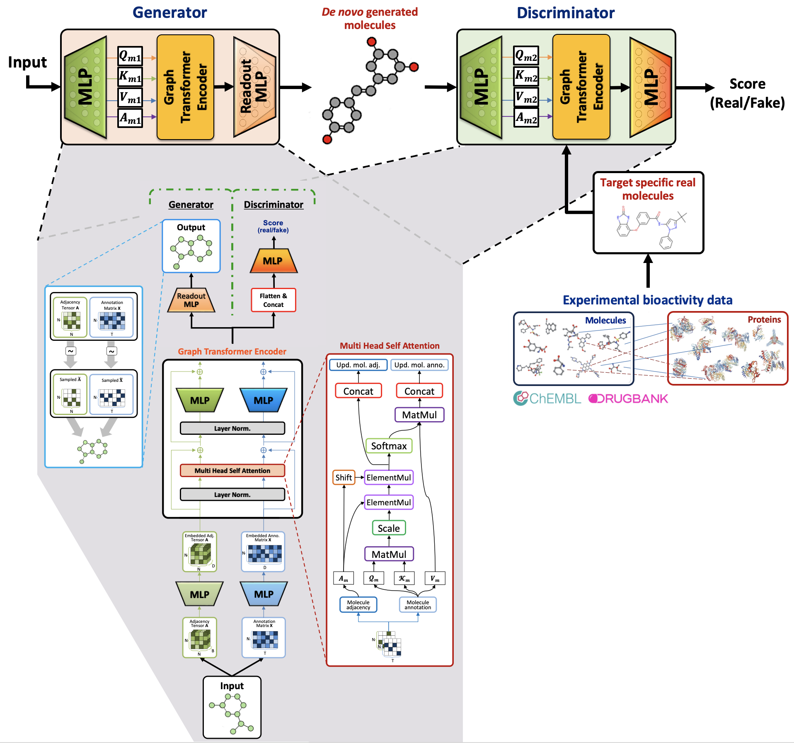

# DrugGEN: Target Specific De Novo Design of Drug Candidate Molecules with Graph Transformer-based Generative Adversarial Networks


<p align="center">
  <a href="https://www.nature.com/articles/s42256-025-01082-y"></a>
  <a href="https://huggingface.co/spaces/HUBioDataLab/DrugGEN"></a>
  <a href="http://www.gnu.org/licenses/"></a>
  
</p>


## PublishedArticle (15.10.2025)!

**Please see our article here:**  [NMI journal article link](https://www.nature.com/articles/s42256-025-01082-y)

**Full-text online read version:** [link](https://rdcu.be/eGoHv)

<a href="https://rdcu.be/eGoHv" target="_blank" rel="noopener noreferrer">link</a>


 <details open>
<summary><h2>Abstract</h2></summary>

Discovering novel drug candidate molecules is a fundamental step in drug development. Generative deep learning models can sample new molecular structures from learned probability distributions; however, their practical use in drug discovery hinges on generating compounds tailored to a specific target molecule. Here we introduce DrugGEN, an end-to-end generative system for the de novo design of drug candidate molecules that interact with a selected protein. The proposed method represents molecules as graphs and processes them using a generative adversarial network that comprises graph transformer layers. Trained on large datasets of drug-like compounds and target-specific bioactive molecules, DrugGEN designed candidate inhibitors for AKT1, a kinase crucial in many cancers. Docking and molecular dynamics simulations suggest that the generated compounds effectively bind to AKT1, and attention maps provide insights into the model’s reasoning. Furthermore, selected de novo molecules were synthesized and shown to inhibit AKT1 at low micromolar concentrations in the context of in vitro enzymatic assays. These results demonstrate the potential of DrugGEN for designing target-specific molecules. Using the open-access DrugGEN codebase, researchers can retrain the model for other druggable proteins, provided a dataset of known bioactive molecules is available.

</details>

<!--Check out our paper below for more details

> [**DrugGEN: Target Centric De Novo Design of Drug Candidate Molecules with Graph Generative Deep Adversarial Networks
**](link here),            
> [Atabey Ünlü](https://tr.linkedin.com/in/atabeyunlu), [Elif Çevrim](https://www.linkedin.com/in/elifcevrim/?locale=en_US), [Ahmet Sarıgün](https://asarigun.github.io/), [Heval Ataş](https://www.linkedin.com/in/heval-atas/), [Altay Koyaş](https://www.linkedin.com/in/altay-koya%C5%9F-8a6118a1/?originalSubdomain=tr), [Hayriye Çelikbilek](https://www.linkedin.com/in/hayriye-celikbilek/?originalSubdomain=tr), [Deniz Cansen Kahraman](https://www.linkedin.com/in/deniz-cansen-kahraman-6153894b/?originalSubdomain=tr), [Abdurrahman Olğaç](https://www.linkedin.com/in/aolgac/?originalSubdomain=tr), [Ahmet S. Rifaioğlu](https://saezlab.org/person/ahmet-sureyya-rifaioglu/), [Tunca Doğan](https://yunus.hacettepe.edu.tr/~tuncadogan/)     
> *Arxiv, 2020* -->

&nbsp;

<!--PUT THE ANIMATED GIF VERSION OF THE DRUGGEN MODEL (Figure 1)-->
<p float="center">
  
</p>

**Fig. 1.** The schematic representation of the architecture of the DrugGEN model with powerful graph transformer encoder modules in both generator and discriminator networks. The generator module transforms the given input into a new molecular representation. The discriminator compares the generated de novo molecules to the known inhibitors of the given target protein, scoring them for their assignment to the classes of "real" and "fake" molecules (abbreviations; MLP: multi-layered perceptron, Norm: normalisation, Concat: concatenation, MatMul: matrix multiplication, ElementMul: element-wise multiplication, Mol. adj: molecule adjacency tensor, Mol. Anno: molecule annotation matrix, Upd: updated).

&nbsp;

 <details open>
<summary><h2>Transformer Module</h2></summary>

Given a random molecule *z*, **the generator** *G* (below) creates annotation and adjacency matrices of a supposed molecule. *G* processes the input by passing it through a multi-layer perceptron (MLP). The input is then fed to the graph transformer encoder module. In the graph transformer setting, *Q*, *K* and *V* are the variables representing the annotation matrix of the molecule. After the final products are created in the attention mechanism, both the annotation and adjacency matrices are forwarded to layer normalization and then summed with the initial matrices to create a residual connection. These matrices are fed to separate feedforward layers, and finally, given to the discriminator network *D* together with real molecules.


<!--PUT HERE 1-2 SENTECE FOR METHOD WHICH SHOULD BE SHORT Pleaser refer to our [arXiv report](link here) for further details.--> 


<!-- - supports both CPU and GPU inference (though GPU is way faster), -->
<!-- ADD HERE SOME FEATURES FOR DRUGGEN & SUMMARIES & BULLET POINTS -->


<!-- ADD THE ANIMATED GIF VERSION OF THE GAN1 AND GAN2 -->

<!-- |------------------------------------------------------------------------------------------------------------| -->
<!-- |  | -->

   

</details>

&nbsp;

 <details open>
<summary><h2>Model Variations</h2></summary>

- **DrugGEN** is the default model. The input of the generator is the real molecules (ChEMBL) dataset (to ease the learning process) and the discriminator compares the generated molecules with the real inhibitors of the given target protein.
- **DrugGEN-NoTarget** is the non-target-specific version of DrugGEN. This model only focuses on learning the chemical properties from the ChEMBL training dataset.

</details>

&nbsp;

 <details open>
<summary><h2>Files & Folders</h2></summary>

The DrugGEN repository is organized as follows:

#### `data/`
- Contains raw dataset files and processed graph data for model training
- `encoders/` - Contains encoder files for molecule representation
- `decoders/` - Contains decoder files for molecule representation
- Format of raw dataset files should be text files containing SMILES strings only

### `src/`
Core implementation of the DrugGEN framework:
- `data/` - Data processing utilities
  - `dataset.py` - Handles dataset creation and loading
  - `utils.py` - Data processing helper functions
- `model/` - Model architecture components
  - `models.py` - Implementation of Generator and Discriminator networks
  - `layers.py` - Contains transformer encoder implementation
  - `loss.py` - Loss functions for model training
- `util/` - Utility functions
  - `utils.py` - Performance metrics and helper functions
  - `smiles_cor.py` - SMILES processing utilities

### `assets/`
- Graphics and figures used in documentation
- Contains model architecture diagrams and visualization resources
- Includes images of generated molecules and model animations

### `results/`
- Contains evaluation results and generated molecules
- `generated_molecules/` - Storage for molecules produced by the model
- `docking/` - Results from molecular docking analyses
- `evaluate.py` - Script for evaluating model performance

### `experiments/`
- Directory for storing experimental artifacts
- `logs/` - Model training logs and performance metrics
- `models/` - Saved model checkpoints and weights
- `samples/` - Molecule samples generated during training
- `inference/` - Molecules generated in inference mode
- `results/` - Experimental results and analyses

### Scripts:
- `train.py` - Main script for training the DrugGEN model
- `inference.py` - Script for generating molecules using trained models
- `setup.sh` - Script for downloading and setting up required resources
- `environment.yml` - Conda environment specification

</details>

&nbsp;

 <details open>
<summary><h2>Datasets</h2></summary>

The DrugGEN model requires two types of data for training: general compound data and target-specific bioactivity data. Both datasets were carefully curated to ensure high-quality training.

### Compound Data

The general compound dataset provides the model with knowledge about valid molecular structures and drug-like properties:

- **Source**: [ChEMBL v29 compound dataset](https://drive.google.com/file/d/1oyybQ4oXpzrme_n0kbwc0-CFjvTFSlBG/view?usp=drive_link)
- **Size**: 1,588,865 stable organic molecules
- **Composition**: Molecules with a maximum of 45 atoms
- **Atom types**: C, O, N, F, Ca, K, Br, B, S, P, Cl, and As
- **Purpose**: Teaches the GAN module about valid chemical space and molecular structures

### Bioactivity Data

The target-specific dataset enables the model to learn the characteristics of molecules that interact with the selected protein targets:

- **Target**: Human AKT1 protein (CHEMBL4282)
  - **Sources**: 
    - ChEMBL bioactivity database (potent inhibitors with pChEMBL ≥ 6, equivalent to IC50 ≤ 1 µM)
    - DrugBank database (known AKT-interacting drug molecules)
  - **Size**: [2,607 bioactive compounds](https://drive.google.com/file/d/1B2OOim5wrUJalixeBTDKXLHY8BAIvNh-/view?usp=drive_link)
  - **Filtering**: Molecules larger than 45 heavy atoms were excluded
  - **Purpose**: Guides the model to generate molecules with potential activity against AKT1<br><br>

- **Target**: Human CDK2 protein (CHEMBL301)
  - **Sources**: 
    - ChEMBL bioactivity database (potent inhibitors with pChEMBL ≥ 6, equivalent to IC50 ≤ 1 µM)
    - DrugBank database (known CDK2-interacting drug molecules)
  - **Size**: [1,817 bioactive compounds](https://drive.google.com/file/d/1C0CGFKx0I2gdSfbIEgUO7q3K2S1P9ksT/view?usp=drive_link)
  - **Filtering**: Molecules larger than 38 heavy atoms were excluded
  - **Purpose**: Guides the model to generate molecules with potential activity against CDK2

### Data Processing

Both datasets undergo extensive preprocessing to convert SMILES strings into graph representations suitable for the model. This includes:
- Conversion to molecular graphs
- Feature extraction and normalization
- Encoding of atom and bond types
- Size standardization

For more details on dataset construction and preprocessing methodology, please refer to our [paper](https://arxiv.org/abs/2302.07868).

</details>

&nbsp;

 <details open>
<summary><h2>Getting Started</h2></summary>

### System Requirements

- **Operating System**: Ubuntu 20.04 or compatible Linux distribution
- **Python**: Version 3.9 or higher
- **Hardware**: 
  - CPU: Supports CPU-only operation
  - GPU: Recommended for faster training and inference (CUDA compatible)
- **RAM**: Minimum 8GB, 16GB+ recommended for larger datasets

### Installation

1. **Clone the repository**:
   ```bash
   git clone https://github.com/HUBioDataLab/DrugGEN.git
   cd DrugGEN
   ```

2. **Set up and activate the environment**:
   ```bash
   conda env create -f environment.yml
   conda activate druggen
   ```

3. **Run the setup script**:
   ```bash
   bash setup.sh
   ```
   
   This script will:
   - Download all necessary resources from our Google Drive repository
   - Create required directories if they don't exist
   - Organize downloaded files in their appropriate locations:
     - Dataset files and SMILES files → `data/`
     - Encoder/decoder files → `data/encoders/` and `data/decoders/`
     - Model weights → `experiments/models/`
     - SMILES correction files → `data/`

Now you're ready to start using DrugGEN for molecule generation or model training. Refer to the subsequent sections for specific usage instructions.

</details>

&nbsp;

 <details open>
<summary><h2>Training</h2></summary>

> **Note**: The first time you run training or inference, it may take longer than expected as the system needs to create and process the dataset files. Subsequent runs will be faster as they use the cached processed data.

You can use the following commands to train different variants of the DrugGEN model. Select the appropriate example based on your target protein or use case:

<table>
<tr>
<td>
<details open>
<summary><b>Generic Example</b></summary>

```bash
python train.py --submodel="[MODEL_TYPE]" \
                --raw_file="data/[GENERAL_DATASET].smi" \
                --drug_raw_file="data/[TARGET_DATASET].smi" \
                --max_atom=[MAX_ATOM_NUM]
```
</details>
</td>
</tr>

<tr>
<td>
<details>
<summary><b>AKT1 Model</b></summary>

```bash
python train.py --submodel="DrugGEN" \
                --raw_file="data/chembl_train.smi" \
                --drug_raw_file="data/akt_train.smi" \
                --max_atom=45
```
</details>
</td>
</tr>

<tr>
<td>
<details>
<summary><b>CDK2 Model</b></summary>

```bash
python train.py --submodel="DrugGEN" \
                --raw_file="data/chembl_train.smi" \
                --drug_raw_file="data/cdk2_train.smi" \
                --max_atom=38
```
</details>
</td>
</tr>

<tr>
<td>
<details>
<summary><b>NoTarget Model</b></summary>

```bash
python train.py --submodel="NoTarget" \
                --raw_file="data/chembl_train.smi" \
                --max_atom=45
```

</details>
</td>
</tr>
</table>

### Detailed Explanation of Arguments

Below is a comprehensive list of arguments that can be used to customize the training process:

<details>
<summary><b>Dataset Arguments</b> (click to expand)</summary>

| Argument | Description | Default Value |
|----------|-------------|---------------|
| `--raw_file` | SMILES containing text file for main dataset. Path to file. | Required |
| `--drug_raw_file` | SMILES containing text file for target-specific dataset (e.g., AKT inhibitors). Required for DrugGEN model, optional for NoTarget model. | Required for DrugGEN |
| `--mol_data_dir` | Directory where the dataset files are stored. | `data` |
| `--drug_data_dir` | Directory where the drug dataset files are stored. | `data` |
| `--features` | Whether to use additional node features (False uses atom types only). | `False` |

**Note**: The processed dataset files are automatically generated from the raw file names by changing their extension from `.smi` to `.pt` and adding the maximum atom number to the filename. For example, if `chembl_train.smi` is used with `max_atom=45`, the processed dataset will be named `chembl_train45.pt`.
</details>

<details>
<summary><b>Model Arguments</b> (click to expand)</summary>

| Argument | Description | Default Value |
|----------|-------------|---------------|
| `--submodel` | Model variant to train: `DrugGEN` (target-specific) or `NoTarget` (non-target-specific). | `DrugGEN` |
| `--act` | Activation function for the model (`relu`, `tanh`, `leaky`, `sigmoid`). | `relu` |
| `--max_atom` | Maximum number of atoms in generated molecules. This is critical as the model uses one-shot generation. | `45` |
| `--dim` | Dimension of the Transformer Encoder model. Higher values increase model capacity but require more memory. | `128` |
| `--depth` | Depth (number of layers) of the Transformer model in generator. Deeper models can learn more complex features. | `1` |
| `--ddepth` | Depth of the Transformer model in discriminator. | `1` |
| `--heads` | Number of attention heads in the MultiHeadAttention module. | `8` |
| `--mlp_ratio` | MLP ratio for the Transformer, affects the feed-forward network size. | `3` |
| `--dropout` | Dropout rate for the generator encoder to prevent overfitting. | `0.0` |
| `--ddropout` | Dropout rate for the discriminator to prevent overfitting. | `0.0` |
| `--lambda_gp` | Gradient penalty lambda multiplier for Wasserstein GAN training stability. | `10` |
</details>

<details>
<summary><b>Training Arguments</b> (click to expand)</summary>

| Argument | Description | Default Value |
|----------|-------------|---------------|
| `--batch_size` | Number of molecules processed in each training batch. | `128` |
| `--epoch` | Total number of training epochs. | `10` |
| `--g_lr` | Learning rate for the Generator network. | `0.00001` |
| `--d_lr` | Learning rate for the Discriminator network. | `0.00001` |
| `--beta1` | Beta1 parameter for Adam optimizer, controls first moment decay. | `0.9` |
| `--beta2` | Beta2 parameter for Adam optimizer, controls second moment decay. | `0.999` |
| `--log_dir` | Directory to save training logs. | `experiments/logs` |
| `--sample_dir` | Directory to save molecule samples during training. | `experiments/samples` |
| `--model_save_dir` | Directory to save model checkpoints. | `experiments/models` |
| `--log_sample_step` | Step interval for sampling and evaluating molecules during training. | `1000` |
| `--parallel` | Whether to parallelize training across multiple GPUs. | `False` |
</details>

<details>
<summary><b>Reproducibility Arguments</b> (click to expand)</summary>

| Argument | Description | Default Value |
|----------|-------------|---------------|
| `--resume` | Whether to resume training from a checkpoint. | `False` |
| `--resume_epoch` | Epoch number to resume training from. | `None` |
| `--resume_iter` | Iteration step to resume training from. | `None` |
| `--resume_directory` | Directory containing model weights to load. | `None` |
| `--set_seed` | Whether to set a fixed random seed for reproducibility. | `False` |
| `--seed` | The random seed value to use if `set_seed` is True. | `1` |
| `--use_wandb` | Whether to use Weights & Biases for experiment tracking. | `False` |
| `--online` | Whether to use wandb in online mode (sync results during training). | `True` |
| `--exp_name` | Experiment name for wandb logging. | `druggen` |
</details>

</details>

&nbsp;

 <details open>
<summary><h2>Molecule Generation with Trained Models</h2></summary>

> **Note**: The first time you run inference, it may take longer than expected as the system needs to create and process the dataset files. Subsequent runs will be faster as they use the cached processed data.

### Using the Hugging Face Interface (Recommended)

For ease of use, we provide a [Hugging Face Space](https://huggingface.co/spaces/HUBioDataLab/DrugGEN) with a user-friendly interface for generating molecules using our pre-trained models.

### Local Generation Using Pre-trained Models

Use the following commands to generate molecules with trained models. Select the appropriate example based on your target protein or use case:

<table>
<tr>
<td>
<details open>
<summary><b>Generic Example</b></summary>

```bash
python inference.py --submodel="[MODEL_TYPE]" \
                    --inference_model="experiments/models/[MODEL_NAME]" \
                    --inf_smiles="data/[TEST_DATASET].smi" \
                    --train_smiles="data/[TRAIN_DATASET].smi" \
                    --train_drug_smiles="data/[TARGET_DATASET].smi" \
                    --sample_num=[NUMBER_OF_MOLECULES] \
                    --max_atom=[MAX_ATOM_NUM]
```
</details>
</td>
</tr>

<tr>
<td>
<details>
<summary><b>AKT1 Model</b></summary>

```bash
python inference.py --submodel="DrugGEN" \
                    --inference_model="experiments/models/DrugGEN-akt1" \
                    --inf_smiles="data/chembl_test.smi" \
                    --train_smiles="data/chembl_train.smi" \
                    --train_drug_smiles="data/akt_train.smi" \
                    --sample_num=1000 \
                    --max_atom=45
```
</details>
</td>
</tr>

<tr>
<td>
<details>
<summary><b>CDK2 Model</b></summary>

```bash
python inference.py --submodel="DrugGEN" \
                    --inference_model="experiments/models/DrugGEN-cdk2" \
                    --inf_smiles="data/chembl_test.smi" \
                    --train_smiles="data/chembl_train.smi" \
                    --train_drug_smiles="data/cdk2_train.smi" \
                    --sample_num=1000 \
                    --max_atom=38
```
</details>
</td>
</tr>

<tr>
<td>
<details>
<summary><b>NoTarget Model</b></summary>

```bash
python inference.py --submodel="NoTarget" \
                    --inference_model="experiments/models/NoTarget" \
                    --inf_smiles="data/chembl_test.smi" \
                    --train_smiles="data/chembl_train.smi" \
                    --train_drug_smiles="data/akt_train.smi" \
                    --sample_num=1000 \
                    --max_atom=45
```
</details>
</td>
</tr>
</table>

#### Output location:
   The generated molecules in SMILES format will be saved to:
   ```
   experiments/inference/[MODEL_NAME]/inference_drugs.csv
   ```

   During processing, the model also creates an intermediate file:
   ```
   experiments/inference/[MODEL_NAME]/inference_drugs.txt
   ```

### Inference Parameters

The inference process can be customized with various arguments to control how molecules are generated and evaluated:

<details>
<summary><b>Required Arguments</b> (click to expand)</summary>

| Argument | Description | Default |
|----------|-------------|---------|
| `--submodel` | Model variant to use: `DrugGEN` (target-specific) or `NoTarget` | `DrugGEN` |
| `--inference_model` | Path to the model weights file | Required |
| `--inf_smiles` | SMILES file for inference | Required |
| `--train_smiles` | SMILES file used for training the main model | Required |
| `--train_drug_smiles` | Target-specific SMILES file used for training | Required |
</details>

<details>
<summary><b>Generation Control</b> (click to expand)</summary>

| Argument | Description | Default |
|----------|-------------|---------|
| `--sample_num` | Number of molecules to generate | `100` |
| `--inf_batch_size` | Batch size for inference | `1` |
| `--disable_correction` | Flag to disable SMILES correction | `False` |
</details>

<details>
<summary><b>Data Arguments</b> (click to expand)</summary>

| Argument | Description | Default Value |
|----------|-------------|---------------|
| `--mol_data_dir` | Directory where datasets are stored | `data` |
| `--features` | Whether to use additional node features | `False` |

**Note**: The processed dataset file for inference is automatically generated from the raw file name by changing its extension from `.smi` to `.pt` and adding the maximum atom number to the filename. For example, if `chembl_test.smi` is used with `max_atom=45`, the processed dataset will be named `chembl_test45.pt`.
</details>

<details>
<summary><b>Model Architecture</b> (click to expand)</summary>

| Argument | Description | Default |
|----------|-------------|---------|
| `--act` | Activation function | `relu` |
| `--max_atom` | Maximum number of atoms in generated molecules | `45` |
| `--dim` | Dimension of the Transformer Encoder model | `128` |
| `--depth` | Depth of the Transformer model | `1` |
| `--heads` | Number of attention heads | `8` |
| `--mlp_ratio` | MLP ratio for the Transformer | `3` |
| `--dropout` | Dropout rate | `0.0` |
</details>

<details>
<summary><b>Reproducibility</b> (click to expand)</summary>

| Argument | Description | Default |
|----------|-------------|---------|
| `--set_seed` | Flag to set a fixed random seed | `False` |
| `--seed` | Random seed value | `1` |
</details>

<details>
<summary><b>Output Files and Metrics</b> (click to expand)</summary>

The inference process generates several files:

1. **Generated molecules**: 
   ```
   experiments/inference/[MODEL_NAME]/inference_drugs.csv
   ```

2. **Evaluation metrics**:
   ```
   experiments/inference/[MODEL_NAME]/inference_results.csv
   ```

The following metrics are reported to evaluate generated molecules:

| Metric | Description |
|--------|-------------|
| **Validity** | Fraction of chemically valid molecules |
| **Uniqueness** | Fraction of unique molecules in the generated set |
| **Novelty** | Fraction of molecules not present in the training set (ChEMBL) |
| **Novelty_test** | Fraction of molecules not present in the test set |
| **Drug_novelty** | Fraction of molecules not present in the target inhibitors dataset |
| **max_len** | Maximum length of generated SMILES strings |
| **mean_atom_type** | Average number of different atom types per molecule |
| **snn_chembl** | Similarity to nearest neighbor in ChEMBL dataset |
| **snn_drug** | Similarity to nearest neighbor in target inhibitors dataset |
| **IntDiv** | Internal diversity of generated molecules |
| **QED** | Average Quantitative Estimate of Drug-likeness |
| **SA** | Average Synthetic Accessibility score |
</details>

</details>

&nbsp;

 <details open>
<summary><h2>Deep Learning-based Bioactivity Prediction</h2></summary>

To evaluate the bioactivity of generated molecules against the AKT1 and CDK2 proteins, we utilize DEEPScreen, a deep learning-based virtual screening tool. Follow these steps to reproduce our bioactivity predictions:

### Setting up DEEPScreen

1. **Download the DEEPScreen model**:
   Download the pre-trained model from [this link](https://drive.google.com/file/d/1aG9oYspCsF9yG1gEGtFI_E2P4qlITqio/view?usp=drive_link)

2. **Extract the model files**:
```bash
# Extract the downloaded file
unzip DEEPScreen2.1.zip
```

### Running Predictions

Execute the following commands to predict bioactivity of your generated molecules:

```bash
# Navigate to the DEEPScreen directory
cd DEEPScreen2.1/chembl_31

# Run prediction for AKT target
python 8_Prediction.py AKT AKT
```

### Output

Prediction results will be saved in the following location:
```
DEEPScreen2.1/prediction_files/prediction_output/
```

These results include bioactivity scores that indicate the likelihood of interaction between the generated molecules and the AKT1 target protein. Higher scores suggest stronger potential binding affinity.

</details>

&nbsp;

 <details open>
<summary><h2>Results (De Novo Generated Molecules of DrugGEN Models)</h2></summary>

The system is trained to design effective inhibitory molecules against the AKT1 protein, which has critical importance for developing treatments against various types of cancer. SMILES notations of the de novo generated molecules from DrugGEN models, along with their deep learning-based bioactivity predictions (DeepScreen), docking and MD analyses, and filtering outcomes, can be accessed under the [results](results) folder. The structural representations of the final selected molecules are depicted in the figure below.

<p float="center">
  
</p>

**Fig. 2.** Promising de novo molecules to effectively target AKT1 protein (generated by DrugGEN model), selected via expert curation from the dataset of molecules with sufficiently low binding free energies (< -8 kcal/mol) in the molecular docking experiment.

</details>

&nbsp;

 <details open>
<summary><h2>Updates</h2></summary>

- 15/09/2025: Peer-reviewed DrugGEN [article](https://www.nature.com/articles/s42256-025-01082-y) is published.
- 12/03/2025: DrugGEN v2.0 is released.
- 26/07/2024: DrugGEN pre-print is updated for v1.5 release.
- 04/06/2024: DrugGEN v1.5 is released.
- 30/01/2024: DrugGEN v1.0 is released.
- 15/02/2023: Our pre-print is shared [here](https://github.com/HUBioDataLab/DrugGEN/files/10828402/2302.07868.pdf).
- 01/01/2023: DrugGEN v0.1 is released.

</details>

&nbsp;

 <details open>
<summary><h2>Citation</h2></summary>

```bash
@article{DrugGEN2025,
  title={Target-specific de novo design of drug candidate molecules with graph transformer-based generative adversarial networks},
  author={Ünlü, Atabey and Çevrim, Elif and Sarıgün, Ahmet and Yiğit, Melih Gökay and Çelikbilek, Hayriye and Bayram, Osman and Güvenilir, Heval Ataş and Koyaş, Altay and Kahraman, Deniz Cansen and Olğaç, Abdurrahman and Rifaioğlu, Ahmet Sureyya and Banoğlu, Erden and Doğan, Tunca},
  journal={Nature Machine Intelligence},
  pages={1--17},
  year={2025},
  publisher={Nature Publishing Group},
  doi={10.1038/s42256-025-01082-y}
}
```

Ünlü, A., Çevrim, E., Sarıgün, A., Yigit, M.G., Çelikbilek, H., Bayram, O., Güvenilir, H.A., Koyaş, A., Kahraman, D.C., Olğaç, A., Rifaioğlu, A., Banoglu, E., Doğan, T. (2025). Target Specific De Novo Design of Drug Candidate Molecules with Graph Transformer-based Generative Adversarial Networks. *Nature Machine Intelligence*, 1-17.

For the static v2.0 of repository, you can refer to the following DOI: [10.5281/zenodo.15014579](https://zenodo.org/records/15014579)

</details>

&nbsp;

 <details open>
<summary><h2>References/Resources</h2></summary>

In each file, we indicate whether a function or script is imported from another source. Here are some excellent sources from which we benefit from: 
<!--ADD THE REFERENCES THAT WE USED DURING THE IMPLEMENTATION-->
- Molecule generation GAN schematic was inspired from [MolGAN](https://github.com/yongqyu/MolGAN-pytorch).
- [MOSES](https://github.com/molecularsets/moses) was used for performance calculation (MOSES Script are directly embedded to our code due to current installation issues related to the MOSES repo).
- [PyG](https://github.com/pyg-team/pytorch_geometric) was used to construct the custom dataset.
- Graph Transformer Encoder architecture was taken from [Dwivedi & Bresson (2021)](https://arxiv.org/abs/2012.09699) and [Vignac et al. (2022)](https://github.com/cvignac/DiGress) and modified. 

Our initial project repository was [this one](https://github.com/asarigun/DrugGEN).

</details>

&nbsp;

<details open>
<summary><h2>License</h2></summary>

Copyright (C) 2025 HUBioDataLab

This program is free software: you can redistribute it and/or modify it under the terms of the GNU General Public License as published by the Free Software Foundation, either version 3 of the License, or (at your option) any later version.

This program is distributed in the hope that it will be useful, but WITHOUT ANY WARRANTY; without even the implied warranty of MERCHANTABILITY or FITNESS FOR A PARTICULAR PURPOSE. See the GNU General Public License for more details.

You should have received a copy of the GNU General Public License along with this program. If not, see http://www.gnu.org/licenses/.

</details>
